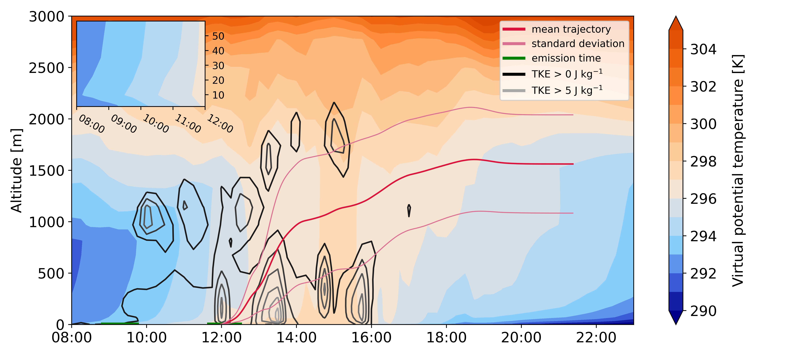

# Trajectory cross-section
## Plotting of a cross-section along a trajectory.

The script draws a cross-section plot from any variable of an atmospheric model along a given trajectory.

### Method
The atmospheric data gets interpolated to the trajectory position (temporal and spatial) with and bi-linear interpolation.

The cross-section is drawn as a filled contour plot.
In the example, the virtual potential temperature is shown.  
As additional information, the turbulent kinetic energy is plotted as a non-filled contour.
Other details, like the vertical position of the mean trajectory, a legend, a zoom to the bottom-most layers, and a color bar are included as well.

Which variable gets plotted can be adjusted easily.

### Sample data
You can find a sample data set to run this code [here](https://doi.org/10.5281/zenodo.3965683).

### Application

The atmospheric data I use in this project are the output of the weather forecast model *[COSMO](http://www.cosmo-model.org/)*.
The trajectory data originate from the Lagrangian particle dispersion model *[Itpas](https://zenodo.org/record/3932248)*.

This software is part of the *Itpas* post-processing. However, the used method can be adapted for projects with similar problems.  Input from other atmospheric and trajectory models should work as well, but I did not test this yet.

<!-- Details on the particle model and its application can be found (later) at Faust et al. (in Prep.) -->

### Requirements
The code is written in python3 as Jupyter Notebook. A copy of the code as python script ([traj-plot.py](traj-plot.py)) is included but will be updated only for the release-versions.

Following packages are used:
- numpy
- matplotlib
- netCDF4
- mpl_toolkits
- datetime

### Citation
Please cite this software as:
